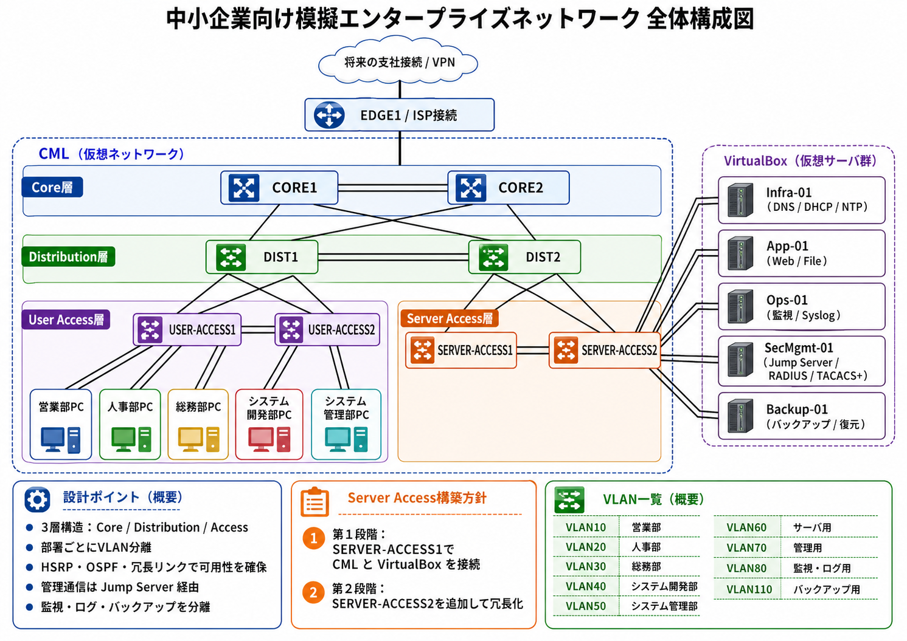
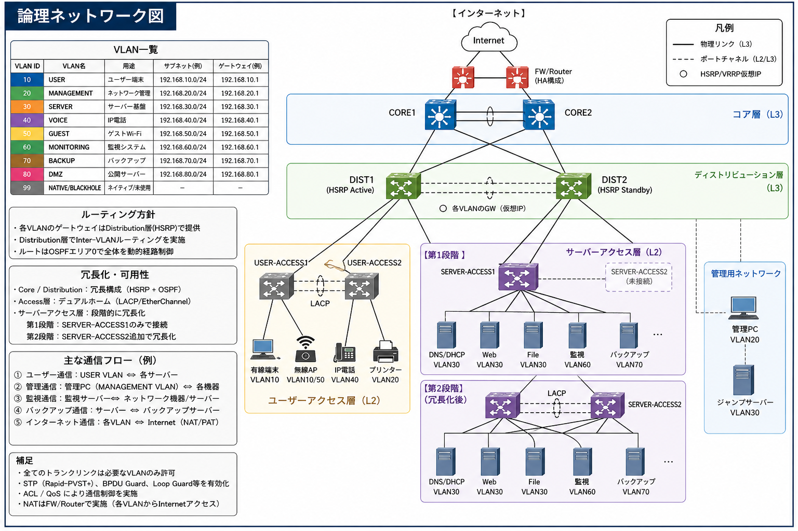
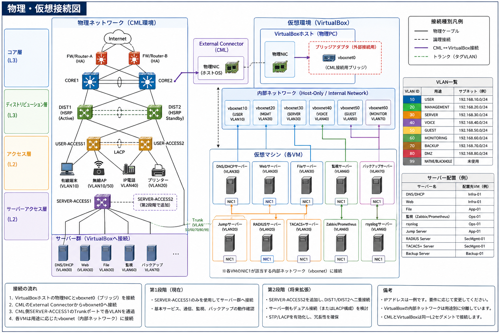
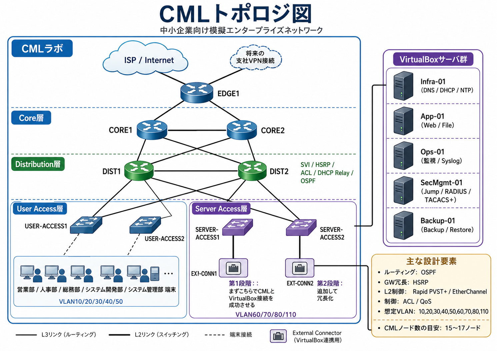

# network_lab

中小企業向け模擬エンタープライズネットワークを、
Cisco Modeling Labs (CML) と VirtualBox を用いて設計・構築・運用する学習プロジェクトです。

本プロジェクトでは、単なる疎通確認だけではなく、以下を含めた「実務を意識したインフラ構築」を目的としています。

* 3層エンタープライズネットワーク設計
* VLAN分割 / ACLによる通信制御
* OSPF / HSRP / EtherChannel による冗長化
* DNS / DHCP / NTP / Web / File サーバ構築
* 監視 / Syslog / バックアップ / AAA
* CMLとVirtualBoxの統合
* 障害試験 / 復旧手順 / Runbook整備

---

# プロジェクト概要

本プロジェクトは、50〜60名規模の中小企業を想定した模擬インフラ環境です。
部署ごとのネットワーク分離、サーバ基盤、監視、ログ管理、認証基盤、バックアップまで含め、実企業に近い構成を再現します。 

## 想定部署

* 営業部
* 人事部
* 総務部
* システム開発部
* システム管理部

## 主な技術要素

* Cisco Modeling Labs (CML)
* VirtualBox
* VLAN
* OSPF
* HSRP
* EtherChannel (LACP)
* Rapid PVST+
* ACL
* DHCP Relay
* SNMPv3
* Syslog
* RADIUS / TACACS+
* Jump Server
* Backup / Restore

---

# 全体構成

## 全体構成図



## 論理ネットワーク図



## 物理・仮想接続図



## CMLトポロジ図



---

# ネットワーク設計

## 3層構造

本ネットワークは、エンタープライズネットワークの基本である3層構造を採用しています。 

* Core層
* Distribution層
* Access層

さらにAccess層を以下に分離しています。

* User Access層
* Server Access層

---

## VLAN設計

| VLAN    | 用途      |
| ------- | ------- |
| VLAN10  | 営業部     |
| VLAN20  | 人事部     |
| VLAN30  | 総務部     |
| VLAN40  | システム開発部 |
| VLAN50  | システム管理部 |
| VLAN60  | サーバ用    |
| VLAN70  | 管理用     |
| VLAN80  | 監視・ログ用  |
| VLAN90  | 検証・ゲスト用 |
| VLAN110 | バックアップ用 |

各VLANには `/24` を割り当て、将来的な拡張を考慮しています。 

---

## 冗長化設計

可用性を考慮し、以下を実装予定です。

* HSRPによるGW冗長化
* OSPFによる動的ルーティング
* EtherChannel (LACP)
* Rapid PVST+
* Distribution層 active 分散
* Server Access層の段階的冗長化

### 第1段階

SERVER-ACCESS1のみでCMLとVirtualBoxを接続

### 第2段階

SERVER-ACCESS2を追加し冗長化

---

# サーバ構成

VirtualBox上に役割ごとにVMを分離して構築します。 

| サーバ        | 主な役割                    |
| ---------- | ----------------------- |
| Infra-01   | DNS / DHCP / NTP        |
| App-01     | Web / File              |
| Ops-01     | Monitoring / Syslog     |
| SecMgmt-01 | Jump / RADIUS / TACACS+ |
| Backup-01  | Backup / Restore        |

---

# 監視・運用

以下の「運用を意識した機能」を実装予定です。

* Syslog集中管理
* Zabbix / Prometheus監視
* SNMPv3
* NTP同期
* Config Backup
* Runbook整備
* 障害試験
* 復旧試験

---

# ディレクトリ構成（予定）

```text
network_lab/
├── README.md
├── docs/
│   ├── diagrams/
│   ├── design/
│   ├── runbook/
│   └── test/
├── configs/
│   ├── core/
│   ├── distribution/
│   ├── access/
│   └── server-access/
├── server/
│   ├── infra/
│   ├── app/
│   ├── monitoring/
│   ├── security/
│   └── backup/
├── scripts/
└── images/
```

---

# 学習目的

このプロジェクトでは、以下の実践力習得を目的としています。

* エンタープライズネットワーク設計
* 実務レベルの冗長化設計
* VLAN / ACL設計
* サーバ基盤構築
* 監視 / ログ管理
* 障害切り分け
* ドキュメント作成
* チーム開発
* インフラ運用設計

---

# 今後実装予定

* ACL詳細設計
* QoS
* NAT/PAT
* VPN
* 支社接続
* Docker活用
* Ansible自動化
* Grafana可視化
* CI/CD的なConfig管理

---

# 参考資料

* 企画書 
* 要件定義書 
* サーバー作成作業フロー 
* ネットワーク作成作業フロー 
* 企業想定資料 

---

